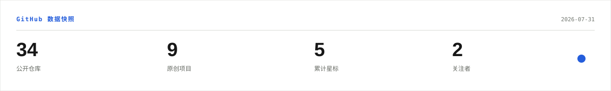
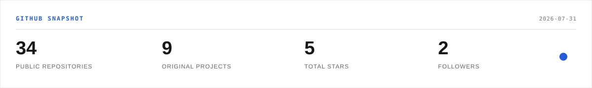

  <strong>Language / 语言:</strong> Chinese is open by default. Expand English below to switch.

<strong>中文</strong>

<picture>
  <source media="(prefers-color-scheme: dark)" srcset="./assets/profile-hero-zh-dark.svg" />
  <source media="(prefers-color-scheme: light)" srcset="./assets/profile-hero-zh-light.svg" />
  
</picture>

  关注可控 Agent、本地优先 AI 与可审计的软件交付。把真实问题拆解为可验证、可复查、可持续维护的工具。

<picture>
  <source media="(prefers-color-scheme: dark)" srcset="./assets/profile-intro-zh-dark.svg" />
  <source media="(prefers-color-scheme: light)" srcset="./assets/profile-intro-zh-light.svg" />
  
</picture>

  <a href="https://yistar.jiezeng2004.me">个人网站</a>
  &middot;
  <a href="https://github.com/jiezeng2004-design?tab=repositories">全部仓库</a>
  &middot;
  <a href="https://github.com/jiezeng2004-design/PatchWarden">PatchWarden</a>

---

### `// 代表项目`

<table>
  <tr>
    <td colspan="2" valign="top">
      <code>旗舰系统 / 01</code>
      
<strong><a href="https://github.com/jiezeng2004-design/PatchWarden">PatchWarden - 查看仓库 &rarr;</a></strong>

      <a href="https://github.com/jiezeng2004-design/PatchWarden">
        <picture>
          <source media="(prefers-color-scheme: dark)" srcset="./assets/project-patchwarden-zh-dark.svg" />
          <source media="(prefers-color-scheme: light)" srcset="./assets/project-patchwarden-zh-light.svg" />
          
        </picture>
      </a>
      
<strong>将已确认的 AI 计划转化为受约束、可审计的本地执行。</strong>

      
<code>TypeScript</code> <code>MCP</code> <code>独立验证</code>

      
<a href="https://github.com/jiezeng2004-design/PatchWarden">仓库</a> &middot; <a href="https://github.com/jiezeng2004-design/PatchWarden/releases">发行版</a>

    </td>
  </tr>
  <tr>
    <td width="50%" valign="top">
      <code>本地 AI / 02</code>
      
<strong><a href="https://github.com/jiezeng2004-design/relay-forge">RelayForge - 查看仓库 &rarr;</a></strong>

      <a href="https://github.com/jiezeng2004-design/relay-forge">
        <picture>
          <source media="(prefers-color-scheme: dark)" srcset="./assets/project-relayforge-zh-dark.svg" />
          <source media="(prefers-color-scheme: light)" srcset="./assets/project-relayforge-zh-light.svg" />
          
        </picture>
      </a>
      
<strong>本地优先的模型路由、回退、隐私日志与兼容接口。</strong>

      
<a href="https://github.com/jiezeng2004-design/relay-forge">仓库</a>

    </td>
    <td width="50%" valign="top">
      <code>工作记忆 / 03</code>
      
<strong><a href="https://github.com/jiezeng2004-design/CodexJournal-Lite">CodexJournal-Lite - 查看仓库 &rarr;</a></strong>

      <a href="https://github.com/jiezeng2004-design/CodexJournal-Lite">
        <picture>
          <source media="(prefers-color-scheme: dark)" srcset="./assets/project-codexjournal-zh-dark.svg" />
          <source media="(prefers-color-scheme: light)" srcset="./assets/project-codexjournal-zh-light.svg" />
          
        </picture>
      </a>
      
<strong>把本地编程会话归档为可搜索的私有工作记忆。</strong>

      
<a href="https://github.com/jiezeng2004-design/CodexJournal-Lite">仓库</a>

    </td>
  </tr>
  <tr>
    <td colspan="2" valign="top">
      <code>桌面体验 / 04</code>
      
<strong><a href="https://github.com/jiezeng2004-design/XJTU-Codex-Theme">XJTU-Codex-Theme - 查看仓库 &rarr;</a></strong>

      <a href="https://github.com/jiezeng2004-design/XJTU-Codex-Theme">
        <picture>
          <source media="(prefers-color-scheme: dark)" srcset="./assets/project-xjtu-theme-zh-dark.svg" />
          <source media="(prefers-color-scheme: light)" srcset="./assets/project-xjtu-theme-zh-light.svg" />
          
        </picture>
      </a>
      
<strong>面向 Codex Desktop 的 source-available 主题与自定义模板。</strong>

      
<a href="https://github.com/jiezeng2004-design/XJTU-Codex-Theme">仓库</a>

    </td>
  </tr>
</table>

### `// GitHub 快照`

  <picture>
    <source media="(prefers-color-scheme: dark)" srcset="./assets/github-stats-zh-dark.svg" />
    <source media="(prefers-color-scheme: light)" srcset="./assets/github-stats-zh-light.svg" />
    
  </picture>

### `// 贡献轨迹`

<picture>
  <source media="(prefers-color-scheme: dark)" srcset="https://raw.githubusercontent.com/jiezeng2004-design/jiezeng2004-design/output/github-contribution-grid-snake-dark.svg" />
  <source media="(prefers-color-scheme: light)" srcset="https://raw.githubusercontent.com/jiezeng2004-design/jiezeng2004-design/output/github-contribution-grid-snake.svg" />
  
</picture>

<strong>English</strong>

<picture>
  <source media="(prefers-color-scheme: dark)" srcset="./assets/profile-hero-dark.svg" />
  <source media="(prefers-color-scheme: light)" srcset="./assets/profile-hero-light.svg" />
  
</picture>

  
  
  
  
  

<picture>
  <source media="(prefers-color-scheme: dark)" srcset="./assets/profile-intro-dark.svg" />
  <source media="(prefers-color-scheme: light)" srcset="./assets/profile-intro-light.svg" />
  
</picture>

  <a href="https://yistar.jiezeng2004.me">Personal site</a>
  &middot;
  <a href="https://github.com/jiezeng2004-design?tab=repositories">Repositories</a>
  &middot;
  <a href="https://github.com/jiezeng2004-design/PatchWarden">PatchWarden</a>

---

### `// FEATURED_SYSTEMS` - Selected work

<table>
  <tr>
    <td colspan="2" valign="top">
      <code>FLAGSHIP / 01</code>
      
<strong><a href="https://github.com/jiezeng2004-design/PatchWarden">PatchWarden - View repository &rarr;</a></strong>

      <a href="https://github.com/jiezeng2004-design/PatchWarden">
        <picture>
          <source media="(prefers-color-scheme: dark)" srcset="./assets/project-patchwarden-dark.svg" />
          <source media="(prefers-color-scheme: light)" srcset="./assets/project-patchwarden-light.svg" />
          
        </picture>
      </a>
      
<strong>Turn approved AI plans into guarded, auditable local execution.</strong>

      
<code>TypeScript</code> <code>MCP</code> <code>Verification</code>

      
<a href="https://github.com/jiezeng2004-design/PatchWarden">Repository</a> &middot; <a href="https://github.com/jiezeng2004-design/PatchWarden/releases">Releases</a>

    </td>
  </tr>
  <tr>
    <td width="50%" valign="top">
      <code>LOCAL AI / 02</code>
      
<strong><a href="https://github.com/jiezeng2004-design/relay-forge">RelayForge - View repository &rarr;</a></strong>

      <a href="https://github.com/jiezeng2004-design/relay-forge">
        <picture>
          <source media="(prefers-color-scheme: dark)" srcset="./assets/project-relayforge-dark.svg" />
          <source media="(prefers-color-scheme: light)" srcset="./assets/project-relayforge-light.svg" />
          
        </picture>
      </a>
      
<strong>Local-first routing, fallback, privacy logs, and compatible AI APIs.</strong>

      
<a href="https://github.com/jiezeng2004-design/relay-forge">Repository</a>

    </td>
    <td width="50%" valign="top">
      <code>WORK MEMORY / 03</code>
      
<strong><a href="https://github.com/jiezeng2004-design/CodexJournal-Lite">CodexJournal-Lite - View repository &rarr;</a></strong>

      <a href="https://github.com/jiezeng2004-design/CodexJournal-Lite">
        <picture>
          <source media="(prefers-color-scheme: dark)" srcset="./assets/project-codexjournal-dark.svg" />
          <source media="(prefers-color-scheme: light)" srcset="./assets/project-codexjournal-light.svg" />
          
        </picture>
      </a>
      
<strong>Archive local coding sessions into a searchable private work memory.</strong>

      
<a href="https://github.com/jiezeng2004-design/CodexJournal-Lite">Repository</a>

    </td>
  </tr>
  <tr>
    <td colspan="2" valign="top">
      <code>DESKTOP EXPERIENCE / 04</code>
      
<strong><a href="https://github.com/jiezeng2004-design/XJTU-Codex-Theme">XJTU-Codex-Theme - View repository &rarr;</a></strong>

      <a href="https://github.com/jiezeng2004-design/XJTU-Codex-Theme">
        <picture>
          <source media="(prefers-color-scheme: dark)" srcset="./assets/project-xjtu-theme-dark.svg" />
          <source media="(prefers-color-scheme: light)" srcset="./assets/project-xjtu-theme-light.svg" />
          
        </picture>
      </a>
      
<strong>Source-available themes and custom templates for Codex Desktop.</strong>

      
<a href="https://github.com/jiezeng2004-design/XJTU-Codex-Theme">Repository</a>

    </td>
  </tr>
</table>

### `// GITHUB_SNAPSHOT` - Public profile data

  <picture>
    <source media="(prefers-color-scheme: dark)" srcset="./assets/github-stats-dark.svg" />
    <source media="(prefers-color-scheme: light)" srcset="./assets/github-stats-light.svg" />
    
  </picture>

### `// CONTRIBUTION_SIGNAL` - Building in public

<picture>
  <source media="(prefers-color-scheme: dark)" srcset="https://raw.githubusercontent.com/jiezeng2004-design/jiezeng2004-design/output/github-contribution-grid-snake-dark.svg" />
  <source media="(prefers-color-scheme: light)" srcset="https://raw.githubusercontent.com/jiezeng2004-design/jiezeng2004-design/output/github-contribution-grid-snake.svg" />
  
</picture>

   
  <a href="https://yistar.jiezeng2004.me">yistar.jiezeng2004.me</a>

