

  <strong>Language / 语言:</strong> Chinese is open by default. Expand English below to switch.

<strong>中文</strong>

<picture>
  <source media="(prefers-color-scheme: dark)" srcset="./assets/profile-hero-zh-dark.svg" />
  <source media="(prefers-color-scheme: light)" srcset="./assets/profile-hero-zh-light.svg" />
  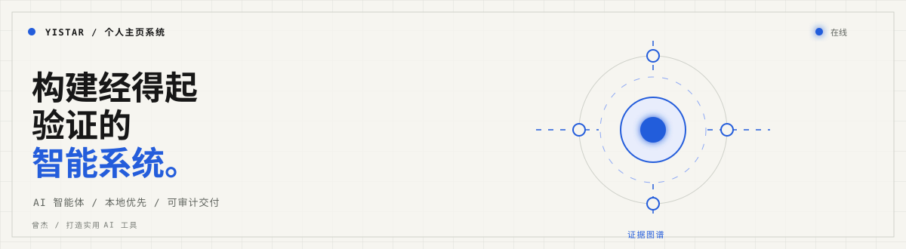
</picture>

  关注可控 Agent、本地优先 AI 与可审计的软件交付。把真实问题拆解为可验证、可复查、可持续维护的工具。

<picture>
  <source media="(prefers-color-scheme: dark)" srcset="./assets/profile-intro-zh-dark.svg" />
  <source media="(prefers-color-scheme: light)" srcset="./assets/profile-intro-zh-light.svg" />
  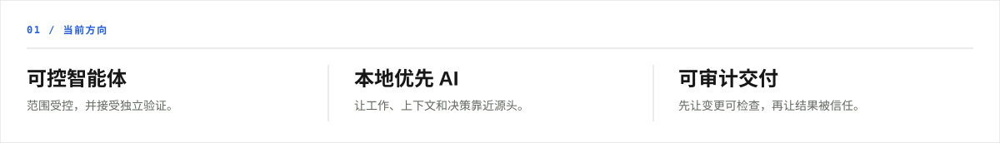
</picture>

  <a href="https://yistar.jiezeng2004.me">个人网站</a>
  &middot;
  <a href="https://github.com/jiezeng2004-design?tab=repositories">全部仓库</a>
  &middot;
  <a href="https://github.com/jiezeng2004-design/PatchWarden">PatchWarden</a>

---

### `// 代表项目`

<table>
  <tr>
    <td colspan="2" valign="top">
      <code>旗舰系统 / 01</code>
      
<strong><a href="https://github.com/jiezeng2004-design/PatchWarden">PatchWarden - 查看仓库 &rarr;</a></strong>

      <a href="https://github.com/jiezeng2004-design/PatchWarden">
        <picture>
          <source media="(prefers-color-scheme: dark)" srcset="./assets/project-patchwarden-zh-dark.svg" />
          <source media="(prefers-color-scheme: light)" srcset="./assets/project-patchwarden-zh-light.svg" />
          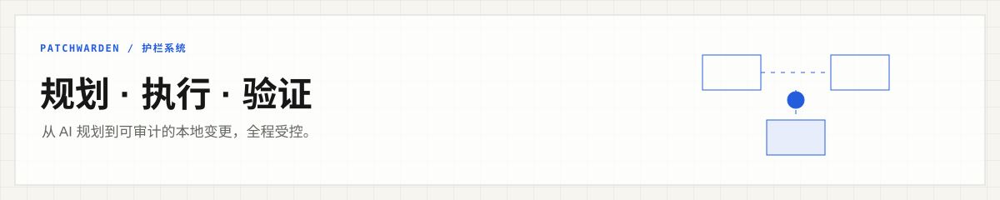
        </picture>
      </a>
      
<strong>将已确认的 AI 计划转化为受约束、可审计的本地执行。</strong>

      
<code>TypeScript</code> <code>MCP</code> <code>独立验证</code>

      
<a href="https://github.com/jiezeng2004-design/PatchWarden">仓库</a> &middot; <a href="https://github.com/jiezeng2004-design/PatchWarden/releases">发行版</a>

    </td>
  </tr>
  <tr>
    <td width="50%" valign="top">
      <code>本地 AI / 02</code>
      
<strong><a href="https://github.com/jiezeng2004-design/relay-forge">RelayForge - 查看仓库 &rarr;</a></strong>

      <a href="https://github.com/jiezeng2004-design/relay-forge">
        <picture>
          <source media="(prefers-color-scheme: dark)" srcset="./assets/project-relayforge-zh-dark.svg" />
          <source media="(prefers-color-scheme: light)" srcset="./assets/project-relayforge-zh-light.svg" />
          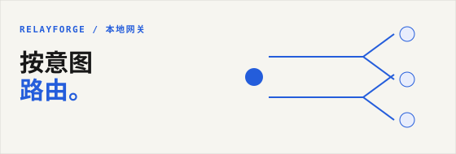
        </picture>
      </a>
      
<strong>本地优先的模型路由、回退、隐私日志与兼容接口。</strong>

      
<a href="https://github.com/jiezeng2004-design/relay-forge">仓库</a>

    </td>
    <td width="50%" valign="top">
      <code>工作记忆 / 03</code>
      
<strong><a href="https://github.com/jiezeng2004-design/CodexJournal-Lite">CodexJournal-Lite - 查看仓库 &rarr;</a></strong>

      <a href="https://github.com/jiezeng2004-design/CodexJournal-Lite">
        <picture>
          <source media="(prefers-color-scheme: dark)" srcset="./assets/project-codexjournal-zh-dark.svg" />
          <source media="(prefers-color-scheme: light)" srcset="./assets/project-codexjournal-zh-light.svg" />
          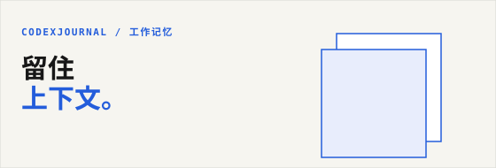
        </picture>
      </a>
      
<strong>把本地编程会话归档为可搜索的私有工作记忆。</strong>

      
<a href="https://github.com/jiezeng2004-design/CodexJournal-Lite">仓库</a>

    </td>
  </tr>
  <tr>
    <td colspan="2" valign="top">
      <code>桌面体验 / 04</code>
      
<strong><a href="https://github.com/jiezeng2004-design/XJTU-Codex-Theme">XJTU-Codex-Theme - 查看仓库 &rarr;</a></strong>

      <a href="https://github.com/jiezeng2004-design/XJTU-Codex-Theme">
        <picture>
          <source media="(prefers-color-scheme: dark)" srcset="./assets/project-xjtu-theme-zh-dark.svg" />
          <source media="(prefers-color-scheme: light)" srcset="./assets/project-xjtu-theme-zh-light.svg" />
          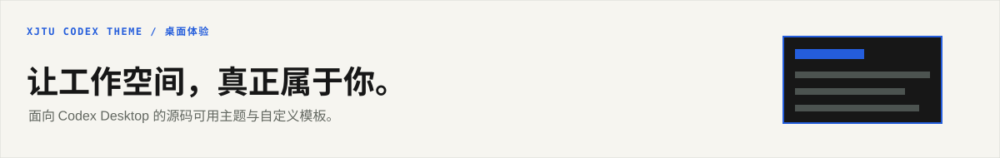
        </picture>
      </a>
      
<strong>面向 Codex Desktop 的 source-available 主题与自定义模板。</strong>

      
<a href="https://github.com/jiezeng2004-design/XJTU-Codex-Theme">仓库</a>

    </td>
  </tr>
</table>

<!-- profile:auto:latest-zh:start -->
### `// 最近发布`

<table>
  <tr>
    <td width="50%" valign="top">
      <code>AGENT BRIDGE / v0.3.0</code>
      
<strong><a href="https://github.com/jiezeng2004-design/dsh-chatgpt-bridge">dsh-chatgpt-bridge &rarr;</a></strong>

      
让 ChatGPT 创建、继续并控制 DeepSeek Harness Agent 会话的 MCP 桥接器。

      
<code>JavaScript</code> <code>MCP</code> <code>ChatGPT</code>

      
<a href="https://github.com/jiezeng2004-design/dsh-chatgpt-bridge">仓库</a> &middot; <a href="https://github.com/jiezeng2004-design/dsh-chatgpt-bridge/releases/tag/v0.3.0">v0.3.0</a>

    </td>
    <td width="50%" valign="top">
      <code>ALIGNMENT / v0.2.1</code>
      
<strong><a href="https://github.com/jiezeng2004-design/dsh-requirements-alignment">dsh-requirements-alignment &rarr;</a></strong>

      
在执行前对齐关键需求，让 Agent 少猜测、少返工，同时保持工作流轻量。

      
<code>TypeScript</code> <code>Agent</code> <code>Requirements</code>

      
<a href="https://github.com/jiezeng2004-design/dsh-requirements-alignment">仓库</a> &middot; <a href="https://github.com/jiezeng2004-design/dsh-requirements-alignment/releases/tag/v0.2.1">v0.2.1</a>

    </td>
  </tr>
  <tr>
    <td width="50%" valign="top">
      <code>ANALYTICS / v0.1.0</code>
      
<strong><a href="https://github.com/jiezeng2004-design/x-algorithm-auditor">X Algorithm Auditor &rarr;</a></strong>

      
基于公开 X 算法的本地、可解释 Analytics 审计工具。

      
<code>Python</code> <code>Analytics</code> <code>Explainable</code>

      
<a href="https://github.com/jiezeng2004-design/x-algorithm-auditor">仓库</a> &middot; <a href="https://github.com/jiezeng2004-design/x-algorithm-auditor/releases/tag/v0.1.0">v0.1.0</a>

    </td>
    <td width="50%" valign="top">
      <code>CREATOR TOOL / v2.0.0</code>
      
<strong><a href="https://github.com/jiezeng2004-design/DraftPulse">DraftPulse &rarr;</a></strong>

      
面向 X/Twitter 的 AI 回复草稿与互动洞察浏览器扩展。

      
<code>JavaScript</code> <code>Browser Extension</code> <code>AI</code>

      
<a href="https://github.com/jiezeng2004-design/DraftPulse">仓库</a> &middot; <a href="https://github.com/jiezeng2004-design/DraftPulse/releases/tag/v2.0.0">v2.0.0</a>

    </td>
  </tr>
</table>
<!-- profile:auto:latest-zh:end -->

<!-- profile:auto:snapshot-zh:start -->
### `// GitHub 快照`

<table>
  <tr>
    <td align="center"><strong>43</strong> 公开仓库</td>
    <td align="center"><strong>14</strong> 活跃原创仓库</td>
    <td align="center"><strong>22</strong> 原创仓库 Stars</td>
    <td align="center"><strong>4</strong> Followers</td>
  </tr>
</table>

GitHub 公开数据快照 · 2026-08-17 · Stars 仅统计未归档原创仓库

<!-- profile:auto:snapshot-zh:end -->

### `// 贡献轨迹`

<picture>
  <source media="(prefers-color-scheme: dark)" srcset="https://raw.githubusercontent.com/jiezeng2004-design/jiezeng2004-design/output/github-contribution-grid-snake-dark.svg" />
  <source media="(prefers-color-scheme: light)" srcset="https://raw.githubusercontent.com/jiezeng2004-design/jiezeng2004-design/output/github-contribution-grid-snake.svg" />
  
</picture>

<strong>English</strong>

<picture>
  <source media="(prefers-color-scheme: dark)" srcset="./assets/profile-hero-dark.svg" />
  <source media="(prefers-color-scheme: light)" srcset="./assets/profile-hero-light.svg" />
  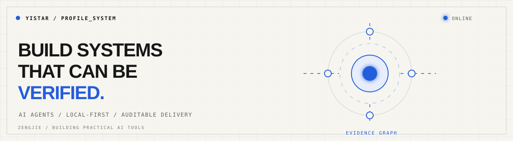
</picture>

  
  
  
  
  

<picture>
  <source media="(prefers-color-scheme: dark)" srcset="./assets/profile-intro-dark.svg" />
  <source media="(prefers-color-scheme: light)" srcset="./assets/profile-intro-light.svg" />
  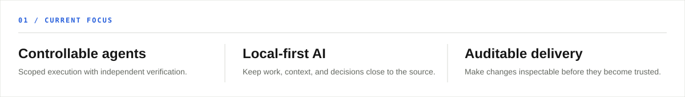
</picture>

  <a href="https://yistar.jiezeng2004.me">Personal site</a>
  &middot;
  <a href="https://github.com/jiezeng2004-design?tab=repositories">Repositories</a>
  &middot;
  <a href="https://github.com/jiezeng2004-design/PatchWarden">PatchWarden</a>

---

### `// FEATURED_SYSTEMS` - Selected work

<table>
  <tr>
    <td colspan="2" valign="top">
      <code>FLAGSHIP / 01</code>
      
<strong><a href="https://github.com/jiezeng2004-design/PatchWarden">PatchWarden - View repository &rarr;</a></strong>

      <a href="https://github.com/jiezeng2004-design/PatchWarden">
        <picture>
          <source media="(prefers-color-scheme: dark)" srcset="./assets/project-patchwarden-dark.svg" />
          <source media="(prefers-color-scheme: light)" srcset="./assets/project-patchwarden-light.svg" />
          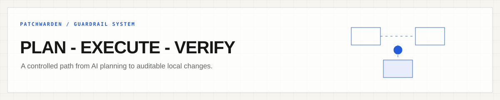
        </picture>
      </a>
      
<strong>Turn approved AI plans into guarded, auditable local execution.</strong>

      
<code>TypeScript</code> <code>MCP</code> <code>Verification</code>

      
<a href="https://github.com/jiezeng2004-design/PatchWarden">Repository</a> &middot; <a href="https://github.com/jiezeng2004-design/PatchWarden/releases">Releases</a>

    </td>
  </tr>
  <tr>
    <td width="50%" valign="top">
      <code>LOCAL AI / 02</code>
      
<strong><a href="https://github.com/jiezeng2004-design/relay-forge">RelayForge - View repository &rarr;</a></strong>

      <a href="https://github.com/jiezeng2004-design/relay-forge">
        <picture>
          <source media="(prefers-color-scheme: dark)" srcset="./assets/project-relayforge-dark.svg" />
          <source media="(prefers-color-scheme: light)" srcset="./assets/project-relayforge-light.svg" />
          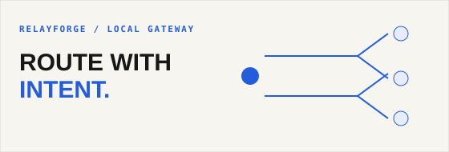
        </picture>
      </a>
      
<strong>Local-first routing, fallback, privacy logs, and compatible AI APIs.</strong>

      
<a href="https://github.com/jiezeng2004-design/relay-forge">Repository</a>

    </td>
    <td width="50%" valign="top">
      <code>WORK MEMORY / 03</code>
      
<strong><a href="https://github.com/jiezeng2004-design/CodexJournal-Lite">CodexJournal-Lite - View repository &rarr;</a></strong>

      <a href="https://github.com/jiezeng2004-design/CodexJournal-Lite">
        <picture>
          <source media="(prefers-color-scheme: dark)" srcset="./assets/project-codexjournal-dark.svg" />
          <source media="(prefers-color-scheme: light)" srcset="./assets/project-codexjournal-light.svg" />
          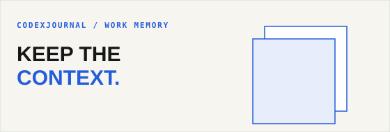
        </picture>
      </a>
      
<strong>Archive local coding sessions into a searchable private work memory.</strong>

      
<a href="https://github.com/jiezeng2004-design/CodexJournal-Lite">Repository</a>

    </td>
  </tr>
  <tr>
    <td colspan="2" valign="top">
      <code>DESKTOP EXPERIENCE / 04</code>
      
<strong><a href="https://github.com/jiezeng2004-design/XJTU-Codex-Theme">XJTU-Codex-Theme - View repository &rarr;</a></strong>

      <a href="https://github.com/jiezeng2004-design/XJTU-Codex-Theme">
        <picture>
          <source media="(prefers-color-scheme: dark)" srcset="./assets/project-xjtu-theme-dark.svg" />
          <source media="(prefers-color-scheme: light)" srcset="./assets/project-xjtu-theme-light.svg" />
          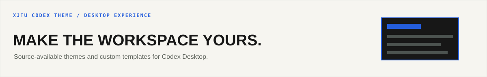
        </picture>
      </a>
      
<strong>Source-available themes and custom templates for Codex Desktop.</strong>

      
<a href="https://github.com/jiezeng2004-design/XJTU-Codex-Theme">Repository</a>

    </td>
  </tr>
</table>

<!-- profile:auto:latest-en:start -->
### `// LATEST_RELEASES` - Recently shipped

<table>
  <tr>
    <td width="50%" valign="top">
      <code>AGENT BRIDGE / v0.3.0</code>
      
<strong><a href="https://github.com/jiezeng2004-design/dsh-chatgpt-bridge">dsh-chatgpt-bridge &rarr;</a></strong>

      
An MCP bridge for creating, continuing, and controlling DeepSeek Harness agent sessions from ChatGPT.

      
<code>JavaScript</code> <code>MCP</code> <code>ChatGPT</code>

      
<a href="https://github.com/jiezeng2004-design/dsh-chatgpt-bridge">Repository</a> &middot; <a href="https://github.com/jiezeng2004-design/dsh-chatgpt-bridge/releases/tag/v0.3.0">v0.3.0</a>

    </td>
    <td width="50%" valign="top">
      <code>ALIGNMENT / v0.2.1</code>
      
<strong><a href="https://github.com/jiezeng2004-design/dsh-requirements-alignment">dsh-requirements-alignment &rarr;</a></strong>

      
Align important requirements before execution so agents guess less and rework less, without a heavyweight spec process.

      
<code>TypeScript</code> <code>Agent</code> <code>Requirements</code>

      
<a href="https://github.com/jiezeng2004-design/dsh-requirements-alignment">Repository</a> &middot; <a href="https://github.com/jiezeng2004-design/dsh-requirements-alignment/releases/tag/v0.2.1">v0.2.1</a>

    </td>
  </tr>
  <tr>
    <td width="50%" valign="top">
      <code>ANALYTICS / v0.1.0</code>
      
<strong><a href="https://github.com/jiezeng2004-design/x-algorithm-auditor">X Algorithm Auditor &rarr;</a></strong>

      
Local, explainable X Analytics audits grounded in the public X algorithm.

      
<code>Python</code> <code>Analytics</code> <code>Explainable</code>

      
<a href="https://github.com/jiezeng2004-design/x-algorithm-auditor">Repository</a> &middot; <a href="https://github.com/jiezeng2004-design/x-algorithm-auditor/releases/tag/v0.1.0">v0.1.0</a>

    </td>
    <td width="50%" valign="top">
      <code>CREATOR TOOL / v2.0.0</code>
      
<strong><a href="https://github.com/jiezeng2004-design/DraftPulse">DraftPulse &rarr;</a></strong>

      
AI-assisted reply drafting and engagement insights for X/Twitter.

      
<code>JavaScript</code> <code>Browser Extension</code> <code>AI</code>

      
<a href="https://github.com/jiezeng2004-design/DraftPulse">Repository</a> &middot; <a href="https://github.com/jiezeng2004-design/DraftPulse/releases/tag/v2.0.0">v2.0.0</a>

    </td>
  </tr>
</table>
<!-- profile:auto:latest-en:end -->

<!-- profile:auto:snapshot-en:start -->
### `// GITHUB_SNAPSHOT` - Public profile data

<table>
  <tr>
    <td align="center"><strong>43</strong> Public repositories</td>
    <td align="center"><strong>14</strong> Active original repos</td>
    <td align="center"><strong>22</strong> Stars on original repos</td>
    <td align="center"><strong>4</strong> Followers</td>
  </tr>
</table>

GitHub public-data snapshot · 2026-08-17 · Stars count non-archived original repositories only

<!-- profile:auto:snapshot-en:end -->

### `// CONTRIBUTION_SIGNAL` - Building in public

<picture>
  <source media="(prefers-color-scheme: dark)" srcset="https://raw.githubusercontent.com/jiezeng2004-design/jiezeng2004-design/output/github-contribution-grid-snake-dark.svg" />
  <source media="(prefers-color-scheme: light)" srcset="https://raw.githubusercontent.com/jiezeng2004-design/jiezeng2004-design/output/github-contribution-grid-snake.svg" />
  
</picture>

   
  <a href="https://yistar.jiezeng2004.me">yistar.jiezeng2004.me</a>

